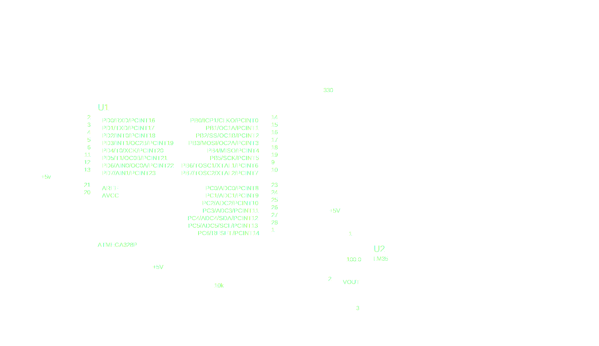

# Digital Temperature Meter

A digital temperature meter system using ATMega328 microcontroller to read the temperature signal and display the reading in °C and °F on three seven segments using the time-multiplexing technique.

## Schematic



### Components

| Item               |      Code      | Purpose                                | Quantity |
| :----------------- | :------------: | :------------------------------------- | :------: |
| Microcontroller    |   ATMega328P   | The Master Mind                        |    1     |
| USBasp Programmer  |                | Burn The Code on The Controller        |    1     |
| Temperature Sensor |      LM35      | Measure The Temperature                |    1     |
| 7-Segment          | Common Cathode | Display Reading                        |    3     |
| Push Buttons       |                | Switch Between °C and °F Modes / Reset |    3     |
| 330Ω Resistor      |                | Ballast Resistors for 7-Segment LEDs   |    7     |
| 10kΩ Resistor      |                | Pull-up Resistor                       |    1     |

## Requirements

For Simulation:
[Proteus 8](https://drive.google.com/file/d/14klePpyCtcBhC-KOPgrHwRtvxZ8HFUhA)

For Development:
[VSCode](https://code.visualstudio.com/download) &
[PlatformIO IDE Extension](https://marketplace.visualstudio.com/items?itemName=platformio.platformio-ide)

## ATMega328P

```text
                              ATMega328P
                             ┍━━━┯━━┯━━━┑
(PCINT14/RESET)          PC6 ┤1  ╰──╯ 28├ PC5   (ADC5/SCL/PCINT13)
(PCINT16/RXD)            PD0 ┤2       27├ PC4   (ADC4/SDA/PCINT12)
(PCINT17/TXD)            PD1 ┤3       26├ PC3   (ADC3/PCINT11)
(PCINT18/INT0)           PD2 ┤4       25├ PC2   (ADC2/PCINT10)
(PCINT19/OC2B/INT1)      PD3 ┤5       24├ PC1   (ADC1/PCINT9)
(PCINT20/XCK/T0)         PD4 ┤6       23├ PC0   (ADC0/PCINT8)
VCC                          ┤7       22├       GND
GND                          ┤8       21├       AREF
(PCINT6/XTAL1/TOSC1)     PB6 ┤9       20├       AVCC
(PCINT7/XTAL2/TOSC2)     PB7 ┤10      19├ PB5   (SCK/PCINT5)
(PCINT21/OC0B/T1)        PD5 ┤11      18├ PB4   (MISO/PCINT4)
(PCINT22/OC0A/AIN0)      PD6 ┤12      17├ PB3   (MOSI/OC2A/PCINT3)
(PCINT23/AIN1)           PD7 ┤13      16├ PB2   (SS/OC1B/PCINT2)
(PCINT0/CLKO/ICP1)       PB0 ┤14      15├ PB1   (OC1A/PCINT1)
                             ┕━━━━━━━━━━┙
```

See Also:

- [ATMega328P Datasheet](http://www.atmel.com/Images/Atmel-42735-8-bit-AVR-Microcontroller-ATMega328-328P_Datasheet.pdf)
- [ATMega328P Cheat Sheet](https://github.com/amirbawab/AVR-cheat-sheet)
